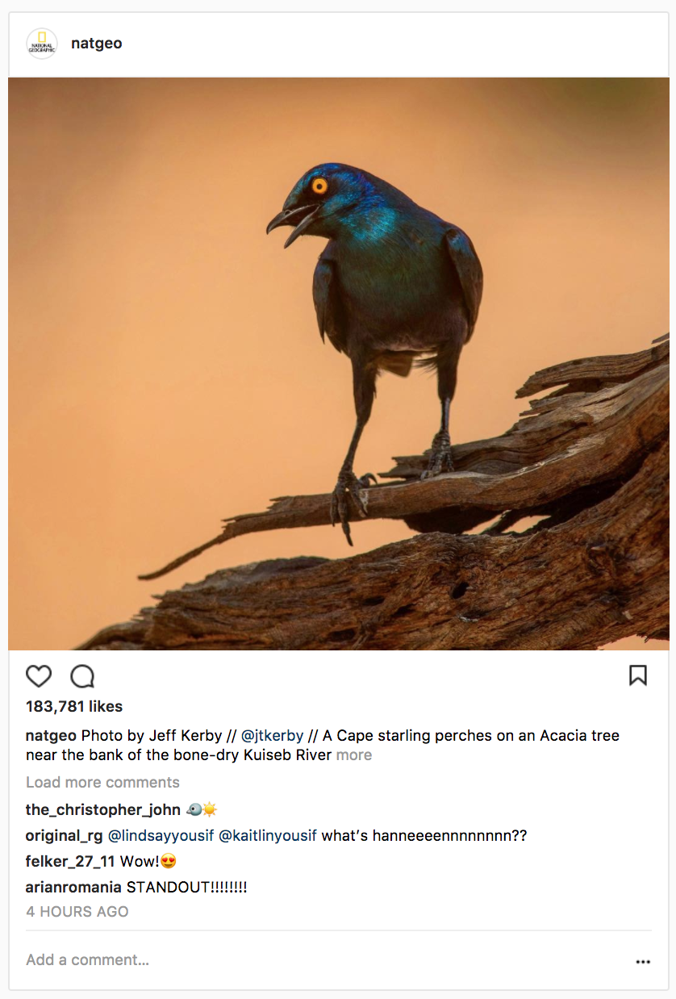

# React-Review Code Challenge

Your challenge is to create a simple instagram post component that can be reused to contain any photo and caption.

Look back to the [React-Intro lesson](https://git.generalassemb.ly/ga-wdi-lessons/react-intro) for help getting started!

### **Bonus: use nested components to add comments to each post**

### **Bonus: create a button component that could be used to like, comment on, or save a post.**